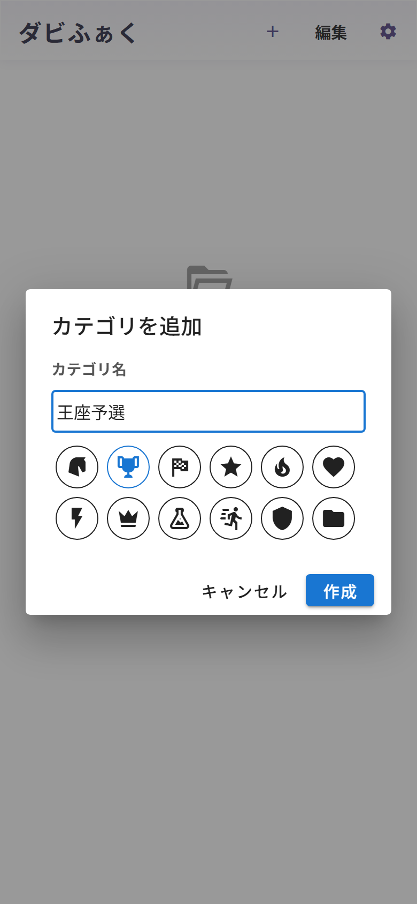

# 第2章 ホーム画面とカテゴリ ── まずは部屋を作ろう

統合版を初めて開くと、こんなホーム画面が出迎えてくれます。

まだ何もない、キックオフ前の静けさ。
中央の **「＋ カテゴリを追加」**(2回目からは右上の「＋」)を押してみましょう。ちなみに右上の歯車マークは設定画面への入口です(第11章で)。

カテゴリ名(12文字まで)を入力して、12種類のアイコンから好きなものを選びます。
私は「王座予選」という名前にして、トロフィーのアイコンを選びました。優勝する気しかないので。

**「作成」** を押すと、作業枠が1つ用意された状態で、そのままカテゴリの中に入ります。

## 以前から使っていた方へ

統合版に切り替わった最初の起動時、それまでの検討内容があった場合は、**「既存データ」というカテゴリが自動で作られて、その中にそのまま引き継がれています**。データが消えることはないので、安心してくださいね。むしろ「あ、私の配合、個室をもらえたんだ」くらいの気持ちでいてください(笑)。

## 次に開いたときは

2回目以降にアプリを開くと、ホームではなく **前回開いていたカテゴリの、前回の作業枠** に直行します。「アプリを開く=即、作業再開」。ロッカールームに寄らずピッチに直行するタイプです。ホームに戻りたいときは、画面左上の「←」からどうぞ(第9章で詳しく)。
