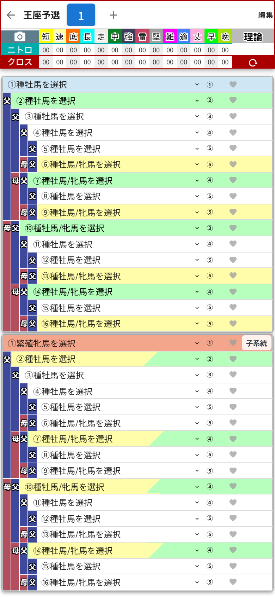
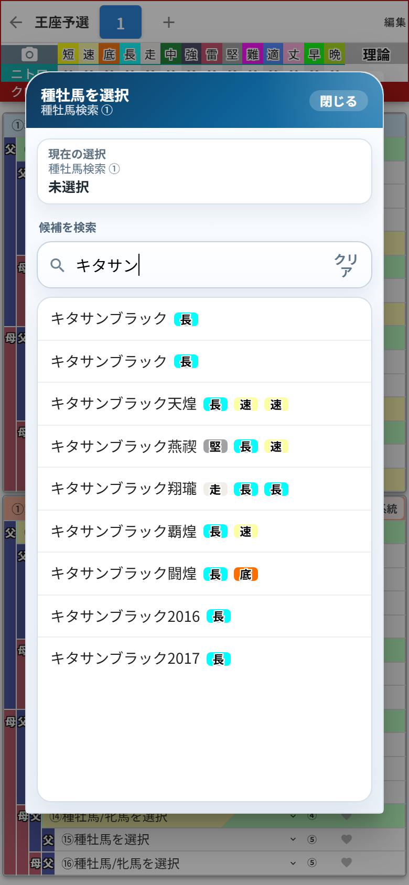
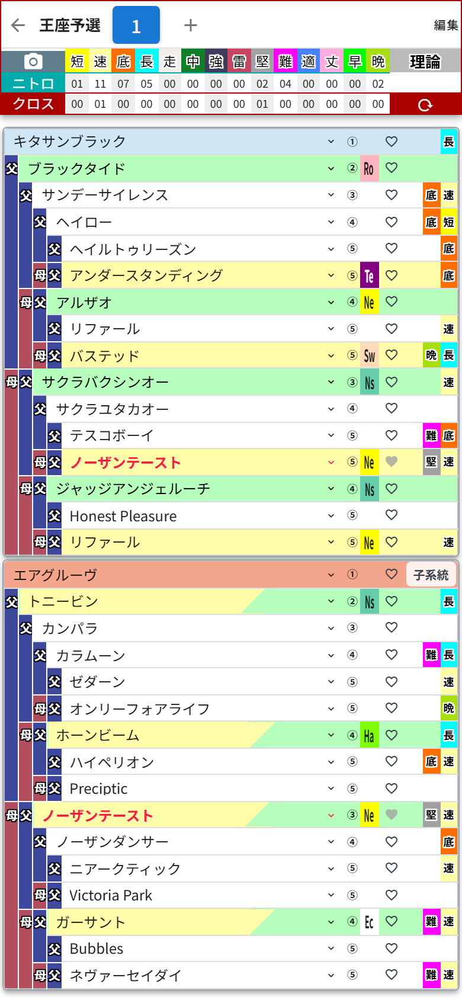

# 第3章 血統表に馬を置いてみよう

カテゴリを開くと、見慣れた(初めての方は今日から見慣れる)血統表の画面です。

画面の上から順に、

- **作業枠タブ**(「← 王座予選 [1] ＋ 編集」の段)
- **集計ヘッダー**(ニトロとクロスの数字が並ぶ段。読み方は第4章で)
- **血統表**(上のカードが父側=種牡馬、下のカードが母側=繁殖牝馬)

という並びになっています。

## 馬を選んでみる

いちばん上の **「①種牡馬を選択」** をタップすると、検索画面が開きます。

名前を入力すると候補がすぐに絞り込まれます。ひらがな・カタカナはどちらでも大丈夫。馬名の横には、その馬が持つ因子もバッジで表示されるので、この時点で「お、長距離因子持ち」と品定めができます。目当ての馬をタップすれば選択完了です(キーボードのEnterで先頭の候補を選ぶこともできます)。

今回は説明用に、キタサンブラックを種牡馬に、エアグルーヴを繁殖牝馬に選んでみました。

どうでしょう、この情報量!

- 5代分の血統が**自動で展開**されて、
- 集計ヘッダーにはニトロの数がずらっと並んで、
- クロスが発生している馬(この配合だとノーザンテースト)は **赤い文字** で教えてくれます。

自分で家系図を書いて数えていた時代を思うと、涙が出ます。

## ここがすごいよ、個別入れ替え

血統表は「先頭の2頭を選んだら終わり」ではありません。**32マスすべて、どのマスも個別にタップして別の馬に差し替えられます**。

「⑥だけ別の種牡馬にしたら、クロスがもう1本増えるのでは?」
「この④を因子持ちに替えたら、ニトロが伸びるのでは?」

……という細かい采配が自由自在。選手交代のカードを何枚でも切れる監督、最高です。

なお、選び直したいマスの検索画面には「クリア」ボタンもあるので、そのマスだけ未選択に戻すこともできます。
