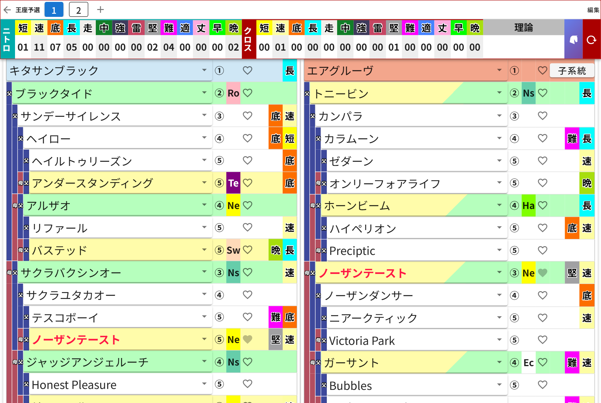

# 第4章 集計ヘッダーの読み方 ── ニトロ・クロス・理論

画面上部に貼り付いている集計ヘッダーは、いわばスタッツボード。試合中ずっとチラチラ見るやつです。ここの読み方を覚えると、ダビふぁくの実況ができるようになります。

PC版だと、こんなふうに血統表2枚と一緒に横長で表示されます。

## ニトロの行

**「短・速・底・長・走・中・強・雷・堅・難・適・丈・早・晩」** の14種類の因子について、血統表の中に何個あるかを数えてくれています。

- 短=短距離 / 速=スピード / 底=底力 / 長=長距離
- 走=道悪 / 中=中距離 / 強=強心臓 / 雷=瞬発力
- 堅=堅実 / 難=気難しい / 適=万能 / 丈=丈夫 / 早=早熟 / 晩=晩成

血統表で馬を入れ替えるたびにリアルタイムで数字が動くので、「速のニトロをあと2つ積みたい……」という試行錯誤が捗ります。

## クロスの行

クロス(インブリード)によって**効果が発生している因子**の数が、こちらの行に集計されます。クロスしている馬は血統表側で赤字になるので、「誰のクロスか」もひと目でわかります。

## 理論のマス

血統表の32マスが**すべて埋まる**と、配合理論の判定が入ります。判定されるのは、

**面白 / 見事 / よくでき / 完璧 / 超完璧 / 奇跡 / 至高**

の7種類。成立すると理論マスの色が変わります。「至高」が出たときの気持ちは、後半アディショナルタイムの決勝ゴールに近いものがあります(個人の感想です)。

## 右端のボタンたち

- **カメラのマーク**(スマホ版・集計表の左上) …… 今の検討画面をスクショ画像として保存できます。フレンドに「この配合どう?」と送るときに便利。
- **馬のマーク** …… 配合の保存・復元ダイアログを開きます(第7章で!)。
- **赤い矢印のマーク** …… 今開いている作業枠をまっさらにリセットします。効くのは**今の作業枠だけ**なので、他のプランは無事です。とはいえ押す前に深呼吸を。
