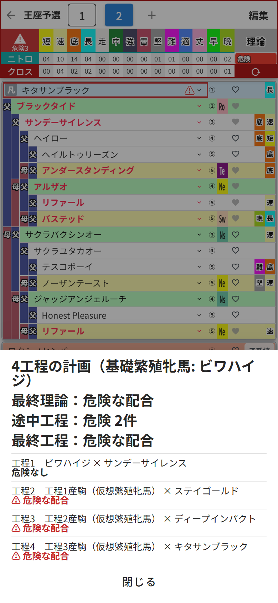
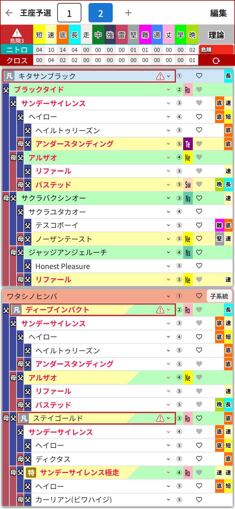

# 第5章 工程診断 ── 段階配合の落とし穴を先に教えてくれる新機能

ダビマス勢の腕の見せどころといえば、**段階配合**。基礎になる繁殖牝馬に何世代か種牡馬を付けて、理想の牝系を自分で作り上げていく、あの長期プロジェクトです。シーズン単位でチームを作り込む、クラブ運営そのものですね。

ただ、段階配合にはこわい落とし穴があります。最終形ばかり見ていると、**途中の世代が「危険な配合」になっている**ことに気づかないんです。ゲーム内で3世代目まで進めてから発覚したときの絶望感といったら……。

それを防いでくれるのが、集計ヘッダー左端の虫めがねマーク、**工程診断** です。

## 計画の組み方

血統表の母側が、そのまま「段階配合の計画表」になります。

1. 母側のいちばん深い **「⑯種牡馬/牝馬を選択」** の枠に、基礎繁殖牝馬を選ぶ(浅い枠から始めれば工程数は少なくなります)
2. 母側の **⑭・⑩・②** の枠に、各世代で付ける種牡馬を順番に選ぶ
3. 父側の **①種牡馬** に、最終工程の種牡馬を選ぶ
4. 32マスがすべて埋まると、工程診断ボタンが **「未診断」** になって押せるようになります(埋まるまでは「残り○枠」表示)

## 診断してみると

ボタンを押すと、基礎繁殖牝馬から順に「工程1の産駒はどうなる? その仔にまた種牡馬を付けたら?」と、**仮想の繁殖牝馬を1世代ずつ作りながら全工程を判定**してくれます。

この例はビワハイジを基礎にして、サンデーサイレンス→ステイゴールド→ディープインパクト→キタサンブラックと付けていく4工程の計画……なのですが、ご覧のとおり工程2以降が軒並み **危険な配合**。サンデーサイレンス系で固めすぎました。監督の私、机に突っ伏しています。

パネルを閉じても結果は残ります。

- 診断ボタンには **「危険3」** のように件数が表示され、
- 血統表では **危険な工程の種牡馬に「⚠」マーク** が付きます。

どの選手起用が問題だったのか、ボードの上でひと目でわかる。この安心感です。

## 覚えておきたい挙動

- 診断は**ボタンを押したときだけ**実行されます。勝手には走りません
- 血統表を1マスでも変えると、古い結果と⚠は消えて「未診断」に戻ります。診断結果はいつでも「今の血統表」のものだけ
- 血統データが足りない馬(登録のない馬など)が混ざった工程は「判定不能」と表示されます。件数はボタンに「不明○」と出ます
- 全工程クリアなら **「危険0」**。これが見たくて何度も組み直すことになります

途中で危険が出たら、その工程の種牡馬を差し替えて再診断。トライアルマッチを何度でも無料でやれると思うと、贅沢な機能です。
