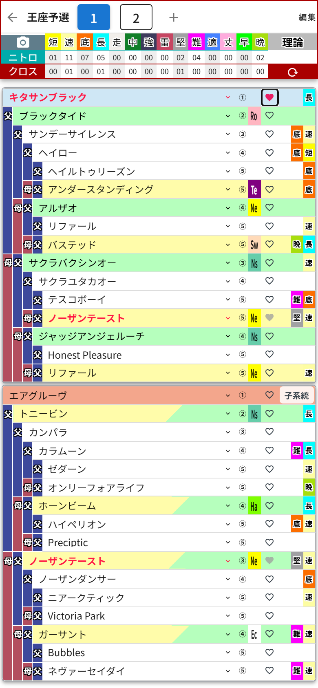

# 第6章 ハートのボタンと自家製馬

## ハートのボタン ── クロスの手動指定

血統表の各行に、小さな**ハートのボタン**が付いているのに気づきましたか?

これは「この馬をクロス扱いにする」を手動で指定するボタンです。ゲーム内の特殊なルールでクロスが成立するケースなど、自動判定に乗らない組み合わせを自分で指定したいときに使います。

キタサンブラックのハートをタップしてみました。馬名が赤字になってハートがピンクに灯り、集計ヘッダーの**クロスの行にもちゃんと数字が反映**されています(「長」が01になりました)。

ハートの見た目は3種類あります。

- **白抜きのハート** …… タップで手動指定できます
- **ピンクのハート** …… 手動指定中。もう一度タップで解除
- **グレーの塗りハート** …… 自動判定で既にクロスしている馬(手動指定は不要なので押せません)

## 自家製馬(★の馬)

検索していると、名前が **「★」から始まる馬** に出会うことがあります。これは自家製馬——つまり自分のゲームで生産した馬を登録したものです。

自家製馬は因子のデータを持っていないので、選択すると **「因子」ボタン** が表示されます。タップすると因子選択ダイアログが開いて、**短・速・底・長・堅・難から1～2個**、その馬が実際に持っている因子を設定できます。設定した因子は、もちろんニトロ集計にも反映されます。

自分の生産馬を血統表に組み込んで次の配合を練る……これぞ「クラブの下部組織から育てた選手をトップチームに昇格させる」感覚。たまりません。
