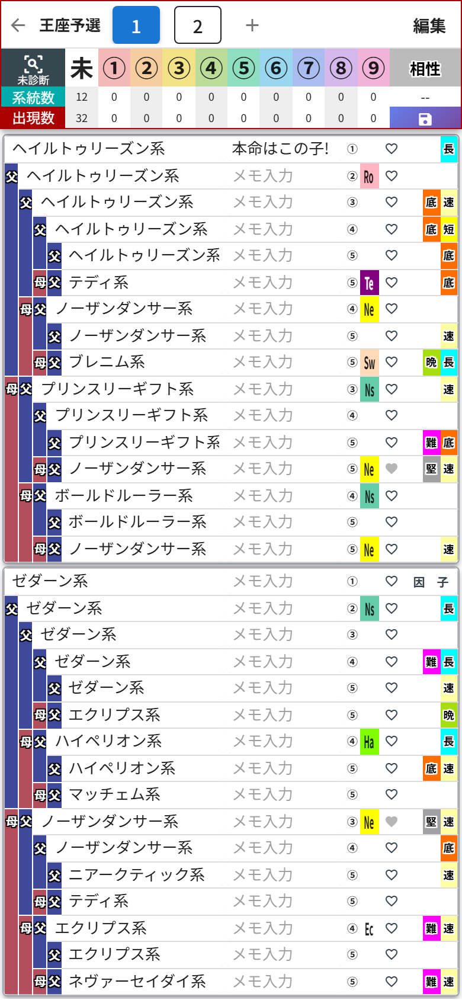

# 第6章 子系統とメモ ── ボードの裏面と、系統サマリー・相性

作戦ボードには裏面があります。
血統表の右側にある **「子系統」ボタン**(母側カードの1行目の右端。PC版は集計ヘッダーの「クロス」のマス)をタップしてみてください。

画面がガラッと変わりました。これが**子系統・メモモード**です。

## 子系統の表示

さっきまで馬名だった場所に、**その馬の子系統**(ヘイルトゥリーズン系、ノーザンダンサー系……)が表示されます。面白配合の条件を考えるとき、「父側と母側で系統がどれだけ散らばっているか」を確認する作業が欠かせないのですが、それがこの一画面で済みます。系統図を思い浮かべながらニヤニヤする時間です。

## 集計ヘッダーも「系統サマリー」に変わる

このモードでは、上の集計ヘッダーがニトロ・クロスから **系統サマリー** に切り替わります。

- **系統数** …… 血統表に何種類の子系統がいるか
- **出現数** …… その色の系統が合計何回登場するか
- **未・①〜⑨** …… 子系統に割り当てた色ごとの集計。色分けは設定画面の「子系統カラー」で決められます(第11章)。何も設定していないうちは、全部「未」の列に入ります

色分けを設定しておくと、血統表の系統名にもその色が付くので、「ノーザンダンサー系が母側に固まってるな」が一瞬で見えるようになります。フォーメーション図の色分けと同じで、視覚化は正義です。

## 相性のマス

右上には **「相性」** のマスがあります。32マスが埋まっていると、種牡馬と母系の系統の組み合わせから、ゲームでいう相性(ニックス)を判定して **完璧 / 優れた / 良い / 程々** の4段階で表示してくれます。該当する組み合わせがないときは「--」のまま。この画面のキタサン×エアグルーヴは「--」でした。相性まで揃えようとすると、また夜が長くなります。

## メモの入力

各マスの「メモ入力」欄には、**マスごとに自由なメモ**を書けます。私はさっそく1行目に「本命はこの子!」と書きました。字面が完全に推し活ですが、配合検討も推し活なので合っています。

- 「次はここを○○に差し替える」
- 「この枠は因子○持ちを探す」

のような検討途中の思考を置いておくのにぴったり。メモももちろん**自動保存**で、作業枠ごとに残ります。

## 元の画面に戻る

同じ場所のボタンが **「因　子」** という表記に変わっているので、それをタップすれば元の血統表モードに戻ります。表→裏→表と、何度でも行き来してOKです。ちなみにスマホ版では、このモードのときだけ右下に**保存ボタン(フロッピー)**が現れます。保存の話は第8章で。
