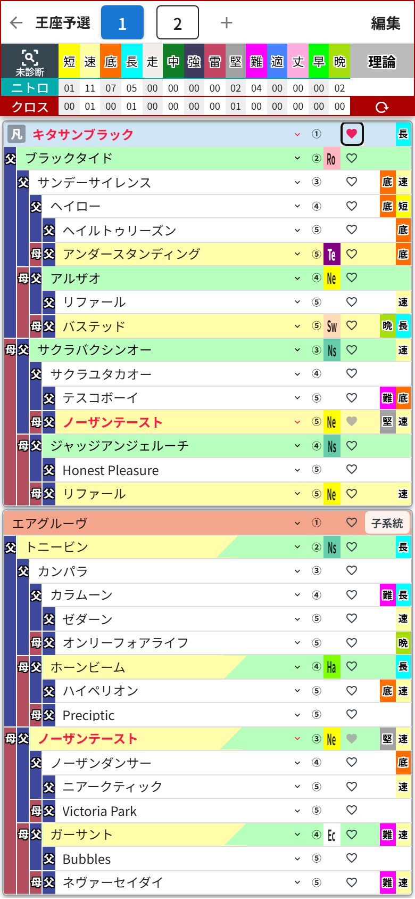

# 第7章 ハートのボタンと★の馬

## ハートのボタン ── クロスの手動指定

血統表の各行に、小さな**ハートのボタン**が付いているのに気づきましたか?

これは「この馬をクロス扱いにする」を手動で指定するボタンです。ゲーム内の特殊なルールでクロスが成立するケースなど、自動判定に乗らない組み合わせを自分で指定したいときに使います。

キタサンブラックのハートをタップしてみました。馬名が赤字になってハートがピンクに灯り、集計ヘッダーの**クロスの行にもちゃんと数字が反映**されています(「長」が01になりました)。

ハートの見た目は3種類あります。

- **白抜きのハート** …… タップで手動指定できます
- **ピンクのハート** …… 手動指定中。もう一度タップで解除
- **グレーの塗りハート** …… 自動判定で既にクロスしている馬(手動指定は不要なので押せません)

## ★の馬 ── 自動で生まれる「薄め」の馬

血統表をいじっていると、名前が **「★」から始まる馬** が現れることがあります。たとえば深いマスに種牡馬を置いたとき、その手前の枠が「★1薄めブラックタイド」のような馬で埋まる、あの現象です。

これはダビふぁくが自動で作る**仮の馬**で、「この配合を成立させるには、間にこういう馬を挟む必要がありますよ」という印。ゲームでいう薄め配合の中継ぎ役です。母側の先頭に現れる「ワタシノヒンバ」も同じ仲間で、まだ名前のない自分の繁殖牝馬を表しています。

★の馬は因子のデータを持っていないので、選択すると **「因子」ボタン** が表示されます。タップすると因子選択ダイアログが開いて、**短・速・底・長・堅・難から1〜2個**、その馬に持たせたい因子を設定できます。設定した因子は、もちろんニトロ集計にも反映されます。実際のゲームで生産した馬の因子を再現しておけば、集計の精度はそのままです。

なお、★の馬はクロス判定の対象外です。仮の馬どうしで赤字が出てしまわないようになっています。

ちなみに、似た記号で **「☆」から始まる馬**(検索では「自」バッジ)もいますが、こちらは自分で保存した配合から生まれた馬。次の章の主役です。下部組織から昇格してきた自前の選手、と言えばもう伝わりますね。
