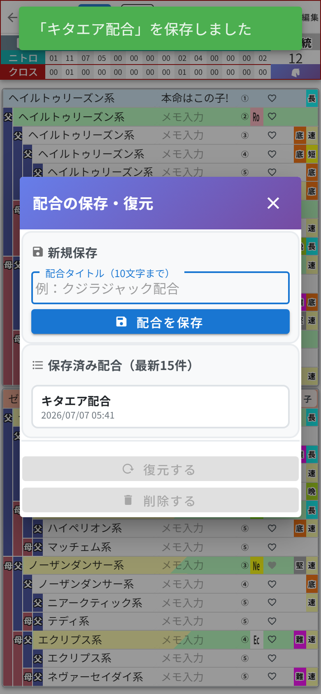

# 第7章 配合の保存・復元 ── 秘蔵の作戦ノート

「この配合、いつかまた使うから取っておきたい」
そんなときのために、**配合の保存・復元** 機能があります。

集計ヘッダーの **馬のマーク** をタップすると開きます(スマホ版では、第5章の子系統・メモモードのときに右端に現れます。PC版は常に表示されています)。

## 保存する

タイトル(10文字まで)を入力して **「配合を保存」** を押すだけ。今の血統表の状態が丸ごと保存されます。私は「キタエア配合」で保存しました。ネーミングセンスは見逃してください。

保存済みの配合は **最新15件** までリストに並びます。

## 復元する

リストから配合を選んで **「復元する」** を押すと、その配合が今開いている作業枠に展開されます。「削除する」で保存済みリストからの削除もできます。

## 作業枠との使い分け

「作業枠があるなら、保存機能はいらないのでは?」と思った方、鋭い。イメージはこうです。

- **作業枠** …… 今まさに動かしている作戦ボード。書いたそばから自動保存
- **配合の保存** …… 完成した作戦を清書してしまっておく、**秘蔵の作戦ノート**

そして大事なポイント。保存した配合と自家製馬は、**カテゴリや作業枠をまたいだ共有の財産**です。どのカテゴリのどの作業枠からでも呼び出せますし、カテゴリを削除しても消えません。永久保存版のスクラップブックです。
