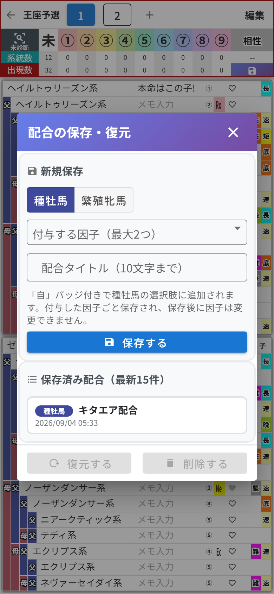
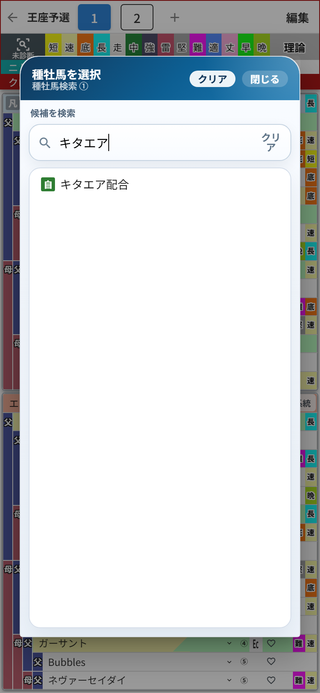

# 第8章 配合の保存・復元 ── 生まれる仔を「馬」として残す

「この配合、いつかまた使うから取っておきたい」
そんなときのために、**配合の保存・復元** 機能があります。しかもアップデートで、ただの保存ではなくなりました。**保存した配合から生まれる仔を、種牡馬・繁殖牝馬として次の配合に使える**ようになったんです。

集計ヘッダーの **フロッピーのマーク** をタップすると開きます(スマホ版では、第6章の子系統・メモモードのときに右下に現れます。PC版は常に表示されています)。

## 保存する

手順は3つだけ。

1. **「種牡馬」か「繁殖牝馬」** を選ぶ(この配合で生まれる仔を、どちらとして登録するか)
2. 種牡馬として保存する場合は、**付与する因子**を最大2つまで選べます(短・速・底・長・堅・難)
3. タイトル(10文字まで)を入力して **「保存する」**

私は「キタエア配合」で保存しました。ネーミングセンスは見逃してください。

保存すると、復元用のデータと一緒に **「☆キタエア配合」という馬** が誕生して、馬の検索候補に加わります。

検索で「キタエア」と打てば、**「自」バッジ**付きでちゃんと出てきます。「自家製」という言葉でも検索できます。この馬を血統表に置けば、5代分の血統も付与した因子もそのまま引き継がれます。自分の配合で作った仔に、次の相手を探す──段階配合の設計が、ぐっとやりやすくなりました。

ひとつだけ注意。**付与した因子は保存したときのもので固定**です。あとから変更はできないので、因子は保存前に決め切ってください。

## 復元する

リストから配合を選んで **「復元する」** を押すと、その配合が今開いている作業枠に展開されます。「削除する」で保存済みリストからの削除もできます。保存済みの配合は **最新15件** までリストに並びます。

昔のバージョンで保存した配合が残っている場合は、「配合」バッジ付きで表示されます。こちらは復元専用で、馬としては検索に出ません。

## 作業枠との使い分け

「作業枠があるなら、保存機能はいらないのでは?」と思った方、鋭い。イメージはこうです。

- **作業枠** …… 今まさに動かしている作戦ボード。書いたそばから自動保存
- **配合の保存** …… 完成した作戦を清書して、**選手として登録までしておく**永久保存版

そして大事なポイント。保存した配合(と☆の馬)は、**カテゴリや作業枠をまたいだ共有の財産**です。どのカテゴリのどの作業枠からでも呼び出せますし、カテゴリを削除しても消えません。
