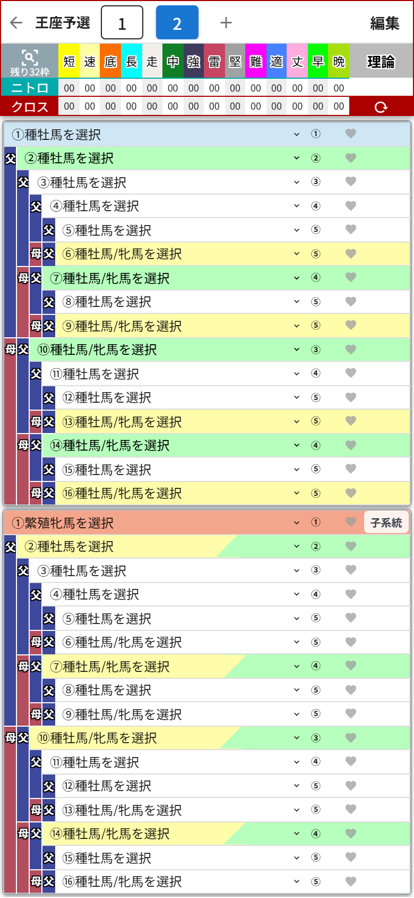
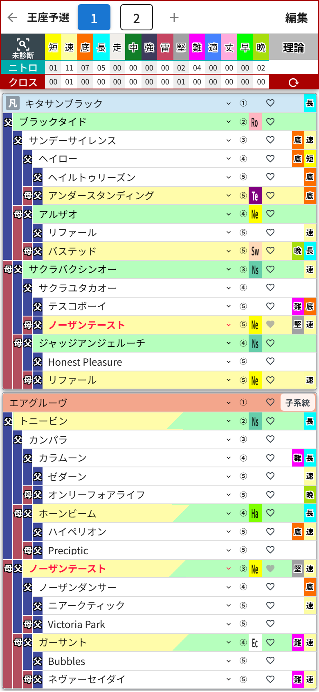

# 第9章 作業枠タブ ── プランA・B・Cを並べて悩む幸せ

ここが統合版のいちばんの推しポイントです。

画面上部のタブの **「＋」** を押すと、新しい作業枠が追加されて、まっさらな血統表が開きます。

タブが「1」「2」と並びました。今は「2」が開いていて、中身は空っぽ。ここに別の配合プランを組んでいけばOKです。

そして **「1」のタブをタップすると──**

さっきのキタサンブラック×エアグルーヴが、そっくりそのまま帰ってきました!
血統表も、ニトロの集計も、メモも、手動のクロス指定も、ぜんぶ一緒に。

## 切り替えのしくみ(ざっくり)

タブを切り替える瞬間に「今の作業枠を保存 → 切り替え先の作業枠を復元」を自動でやってくれています。だから**保存ボタンを押す必要は一切ありません**。切り替え中はタブが一瞬押せなくなりますが、それは保存中の合図なので、慌てずに。

「プラン1とプラン2、ニトロの伸びはどっちが上だろう?」がタブのタップだけで見比べられる。4-3-3と4-4-2を並べて悩む監督の気持ち、味わえます。

## 作業枠の削除

いらなくなった作業枠は、タブ右端の **「編集」** を押すと各タブに「×」が出るので、そこから削除できます。確認ダイアログで「血統表・メモ・クロス指定も削除されます」と教えてくれます。

- 削除すると、残った作業枠の番号は自動で振り直されます(3枠から2番を消すと、3番だった枠が新しい2番に)
- **最後の1枠は削除できません**(削除ボタン自体が出ません)
- 第8章の「配合の保存」で取っておいた配合は、作業枠を消しても無事です
