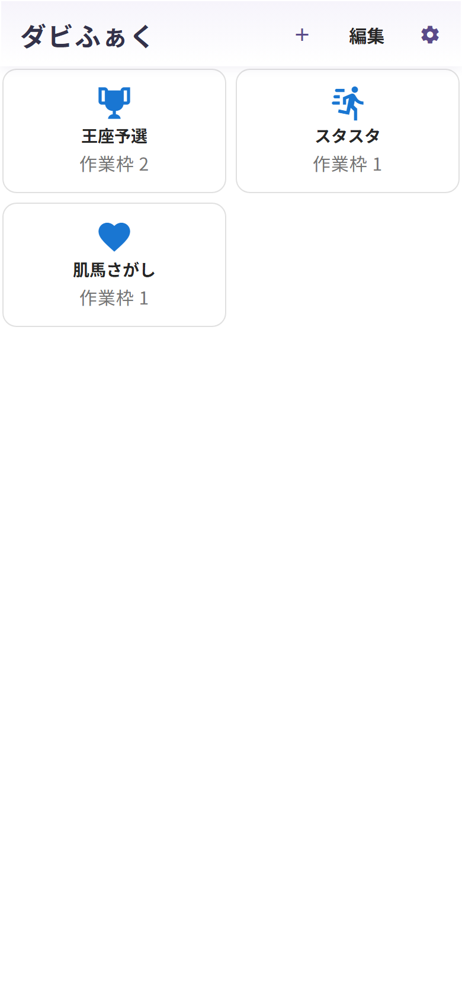

# 第10章 ホーム画面を育てよう

作業枠タブの左端の **「←」** でホームに戻れます(このときも今の作業枠は自動保存されます)。
カテゴリをいくつか作ると、ホームはこんな感じになっていきます。

カードには作業枠の数も表示されるので、「王座予選は2プラン検討中だな」とひと目でわかります。スマホは2列、タブレットは3列、PCは4列で並びます。

## 編集モード

右上の **「編集」** を押すと、編集モードに切り替わります。

- **カードをタップ** …… 名前とアイコンの変更
- **赤い「×」** …… カテゴリの削除
- **「∧」「∨」** …… 表示順の並び替え

終わったら「完了」で通常モードへ。

## 削除だけは、レッドカード級の慎重さで

ひとつだけ、監督としての注意事項です。
**カテゴリを削除すると、その中の作業枠と検討内容(血統表・メモ・クロス指定)もまとめて消えます**。確認ダイアログは出ますが、**取り消しはできません**。

繰り返しになりますが、「配合の保存」で保存した配合と☆の馬は共有の財産なので、カテゴリを消しても残ります。「消える前に、残したいプランは配合保存へ」——これを合言葉にしてください。
