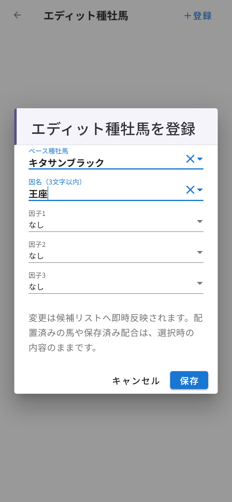
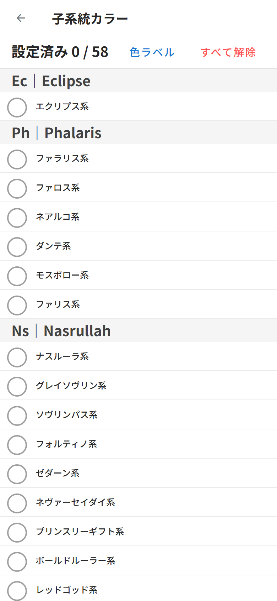

# 第11章 設定画面 ── エディット種牡馬と子系統カラー

ホーム画面の右上、**歯車のマーク**から設定画面に入れます。メニューは2つ。どちらも「自分のチーム事情に合わせてボードをカスタムする」ための機能です。

## エディット種牡馬

ダビマスにはエディット種牡馬(自分のゲームで作った、因子付きの種牡馬)がいますよね。あの子たちをダビふぁくにも登録して、検索候補に並べられます。

**「＋登録」** を押すと、登録ダイアログが開きます。

- **ベース種牡馬** …… 元になる馬を検索して選びます
- **因名(3文字以内)** …… ゲーム内の因名をそのまま入力。既存の因名を候補から選ぶと、対応する因子が自動でセットされる気配りつき
- **因子1〜3** …… その馬が持つ因子を設定

保存すると「キタサンブラック王座」のような名前で、**「E」バッジ**付きで検索候補に加わります。登録できるのは**100件まで**。一覧からいつでも編集・削除できます(変更は候補リストへ即時反映。血統表に配置済みの馬や保存済み配合は、選択したときの内容のまま残ります)。

自軍のエディット種牡馬が普通に検索で出てくる。地味なようで、使い始めると戻れない機能です。

## 子系統カラー

もうひとつのメニューが **子系統カラー**。58ある子系統に、**9色のカラー**を自由に割り当てられます。

子系統は親系統(エクリプス系、ファラリス系、ナスルーラ系……)ごとにグループ分けされていて、丸をタップすると色を選べます。**「色ラベル」** から各色に名前(10文字まで)を付けられるので、「①=スピード系」「②=スタミナ系」のような自分ルールも作れます。「すべて解除」でいつでもまっさらに戻せます。

ここで割り当てた色は、第6章の**子系統・メモモードの色分け**と**系統サマリーの集計**にそのまま反映されます。ユニフォームの色分けを決めるのは監督の仕事。自分の目が追いやすい配色を、ぜひ探してみてください。
